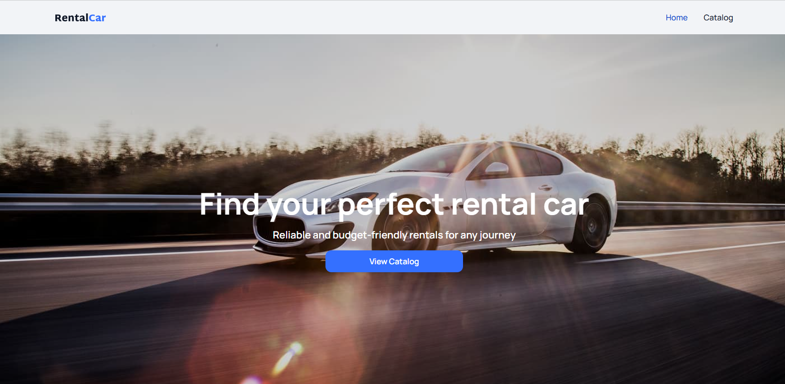
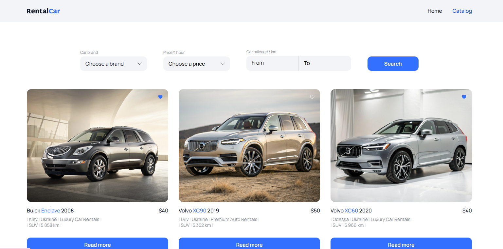
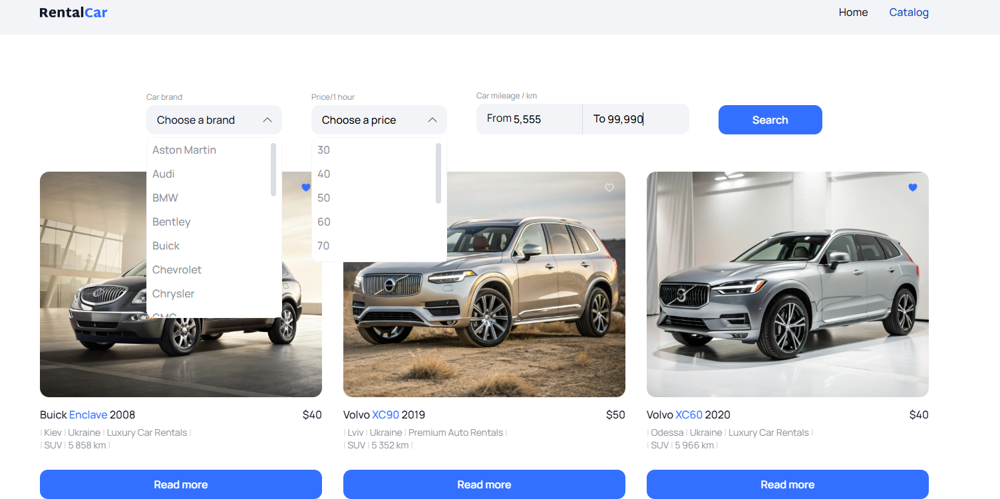
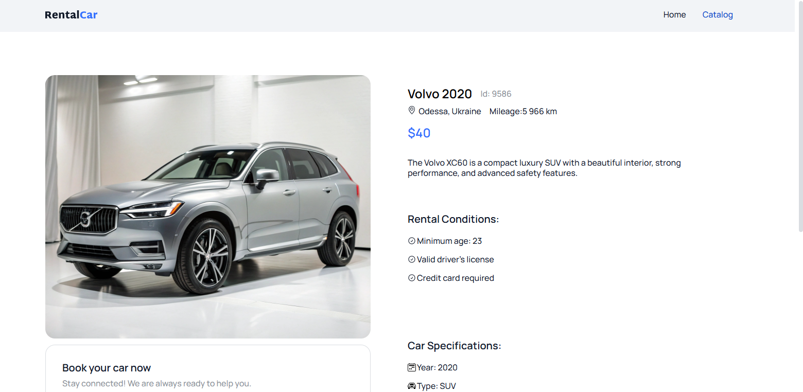

# 🚗 RentalCar

## 📌 Project Description

**RentalCar** is a front-end web application for a car rental company.
Users can browse the catalog of available cars, filter them by
criteria, add favorites, and make a booking.

## 🔗 Demo

- [Deployed on Vercel](https://rental-car-silk.vercel.app)
- [GitHub Repository](https://github.com/Mariia-Petlovana-91/RentalCar)

## 📜 Main Features

- 📌 **Home Page** — A banner with a button linking to the catalog.
- 🚘 **Catalog Page** — A list of cars with filters (brand, price,
  mileage).
- 📝 **Car Details Page** — Detailed information about the car and a
  rental form.
- ⭐ **Favorites** — Saves selected cars in local storage.
- 🔄 **Pagination** — Loads more cars from the backend via the "Load
  More" button.
- 🛠 **Loader** — Loading indicator when making API requests.

## 📍 Routing

- `/` – Home Page
- `/catalog` – Cars Catalog
- `/catalog/:id` – Car Description Page

## ⚙️ Technologies

| Technology           | Description      |
| -------------------- | ---------------- |
| React                | Main library     |
| Vite                 | Bundler          |
| Redux Toolkit        | State management |
| React Router         | Routing          |
| Axios                | HTTP requests    |
| React Hot Toast      | Notifications    |
| ESLint               | Code linter      |
| Prettier             | Code formatter   |
| React Icons          | Icon library     |
| Formik               | Form management  |
| Yup                  | Form validation  |
| Date-Fns             | Form calendar    |
| React Loader Spinner | Form validation  |
| React Redux          | Form state       |

## 🗄 API

This project uses a backend API to fetch car information.

- [📜API Documentation ](#https://car-rental-api.goit.global/api-docs/)

## 🖼 Screenshots

**Home Page**

**Catalog Page**

**Car Details Page**

## ✨ Materials for this project are provided GoIt

- [Сompany website GoIt](https://www.googleadservices.com/pagead/aclk?sa=L&ai=DChcSEwi41Ku7y_GLAxXLR5EFHeuQBCEYABAAGgJscg&co=1&gclid=CjwKCAiA5pq-BhBuEiwAvkzVZeosMp0g2-bgZq1Ch3uh0NGc4OfYDqZrtSunzdDrkFV4zlC5XoE5iBoCRgYQAvD_BwE&ohost=www.google.com&cid=CAESVOD2eYjBowlv0Fzgm-qpiUS14QI2J21-y2o0MZfPmtHAtem227N_X1FC0US-b8V2TjURLS5v9H7miGGXN8JgKthxOW0GbkyOeFy0_M42g10NXQuEXw&sig=AOD64_28sKgTC_NgJp5Vv07ngXx-LQ25PA&q&adurl&ved=2ahUKEwibk6e7y_GLAxVQGxAIHVCaANsQ0Qx6BAgYEAE)

- 

## 👨‍💻 Author

**Petlovana Mariia**  
📧 Email: petlovanam333@gmail.com
